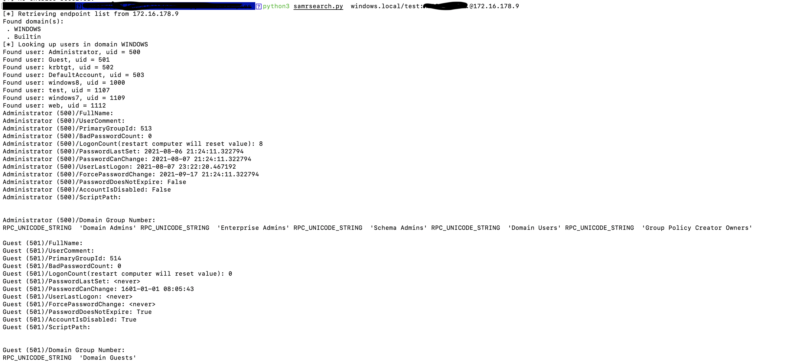

# SamrSearch

SamrSearch can get user info and group info with MS-SAMR.like `net user aaa /domain` and `net group aaa /domain`

impacket中通过MS-SAMR协议实现net user和net group的功能，能方便在域内没有可控windows主机的情况下，对用户权限和用户信息进行收集。

# Install 

Python 3.5+impacket

# Usage

```
usage: samrsearch.py [-h] [-csv] [-ts] [-debug] [-username USERNAME] [-groupname GROUPNAME] [-dc-ip ip address] [-target-ip ip address] [-port [destination port]] [-hashes LMHASH:NTHASH] [-no-pass] [-k] [-aesKey hex key] target

This script downloads the list of users for the target system.

positional arguments:
  target                [[domain/]username[:password]@]<targetName or address>

optional arguments:
  -h, --help            show this help message and exit
  -csv                  Turn CSV output
  -ts                   Adds timestamp to every logging output
  -debug                Turn DEBUG output ON
  -username USERNAME    Username you want to search
  -groupname GROUPNAME  Group you want to search

connection:
  -dc-ip ip address     IP Address of the domain controller. If ommited it use the domain part (FQDN) specified in the target parameter
  -target-ip ip address
                        IP Address of the target machine. If ommited it will use whatever was specified as target. This is useful when target is the NetBIOS name and you cannot resolve it
  -port [destination port]
                        Destination port to connect to SMB Server

authentication:
  -hashes LMHASH:NTHASH
                        NTLM hashes, format is LMHASH:NTHASH
  -no-pass              don't ask for password (useful for -k)
  -k                    Use Kerberos authentication. Grabs credentials from ccache file (KRB5CCNAME) based on target parameters. If valid credentials cannot be found, it will use the ones specified in the command line
  -aesKey hex key       AES key to use for Kerberos Authentication (128 or 256 bits)
```


net user windows8 /domain: `python3 samrsearch.py windows.local/test:aaa@172.16.178.9 -username "windows8" `


net group "Domain Admins" /domain:`python3 samrsearch.py windows.local/test:aaa@172.16.178.9 -groupname "Domain Admins"`


With default ,it will dump all user info

`python3 samrsearch.py windows.local/test:aaa@172.16.178.9 `


